# Web Chat Server

## Table of Contents
1.[Project Information](#project-information) 
2.[Improvements](#improvements) 
3.[How to Run](#how-to-run) 
4.[Contribution Report](#contribution-report) 

## Project Information

This project involves creating a web chat server using WebSockets and HTML/CSS/JS in a Java Web Application project. The chat server can hold multiple chatrooms working synchronously and independent of each other. Each chatroom has an automatically generated code, and users are able to either create a new chatroom or join an existing one. The server directly greets users who enter a chatroom, and announces their entrances to everyone in the chatroom. Users are able to send and receive messages in the chatroom in real-time. Every message is time-stamped. Our own improvements are listen below, in the [Improvements](#improvements) section.

Group Members:
- Alan Ward 
- Ali Hu 
- Alreda Alhadi 
- Joshua Juan 

Video of The Application Running: 

https://github.com/OntarioTech-CS-program/w24-csci2020u-assignment02-alhadi-hu-juan-ward/assets/114015131/317f1247-510c-4600-9b83-f12af14943e6

 
The video file of the screen recording is also provided at 'images/ScreenRecordings/Assignment2SubmissionVideo'.
 

## Improvements

#### UI improvements
- Visual Appeal 
    - changed colour scheme, added borders, rounded off sharp corners, changed fonts, etc. to increase visual appeal.
      
- Animations
    - Added animations for when the page is loaded, and for when the user's cursor hovers over a button. 

#### Functionality improvements
- Buttons
    - Added a button to refresh the list of chat rooms, and another button to send messages to the chat.
        
- Typing Indicator
    - Whenever a user is typing, everyone in the same chatroom can see that they are typing through the typing indicator text area,which is between the chatroom and the input field.
        
- User's Current Status
    - Users can enter their current status on the right side, under the list of users in the same chatroom. Anyone in the same chatroom can hover over the user's name in the user list on the right, which displays their status if they set one. All Statuses in a chatroom reset when a user leaves the chatroom or a new user enters.
        
- Sending images 
    - Users are able to select a png or jpeg file from their system and upload it to their client. When they click the send button, the image is encoded in base64, sent as a JSON message to server where it is sent to every client that is in the chatroom. The client decodes the image and displays in the chatroom.
        
- Chat History (incomplete, code exists but is commented out)

## How to Run

Before being able to run the application, you need to clone this repository from the GitHub page onto your own machine. You should already be on the GitHub page, but if you aren't, <a href="https://github.com/OntarioTech-CS-program/w24-csci2020u-assignment02-alhadi-hu-juan-ward">click here</a>. We are also assuming that you will run IntelliJ IDEA as an administrator.

### To clone the application
1. Click on green button that says "<> Code". 
    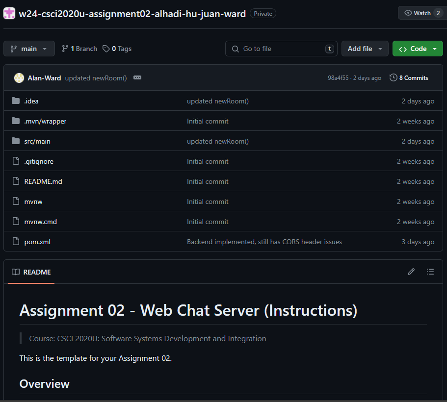
      
2. Copy the HTTPS git clone URL. 
    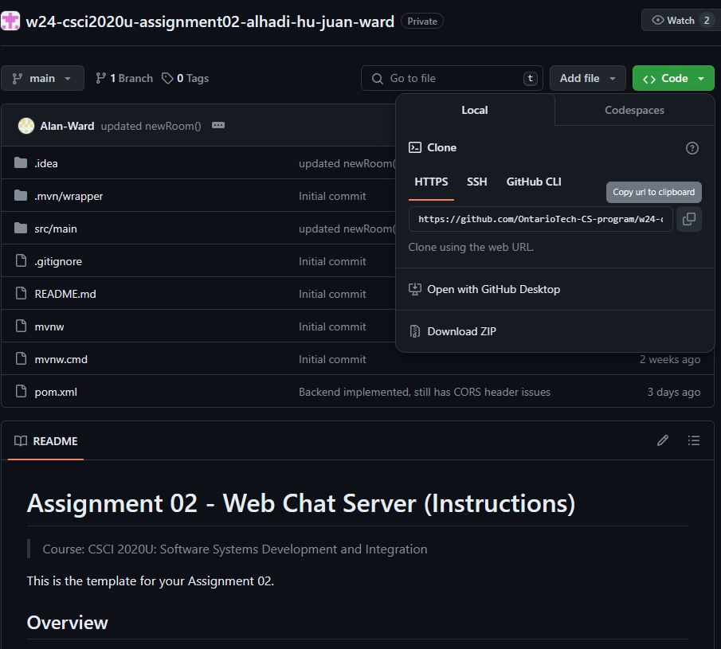
      
3. Open the IntelliJ IDEA project tab, and click the button in the top right that says "Get from VCS". 
    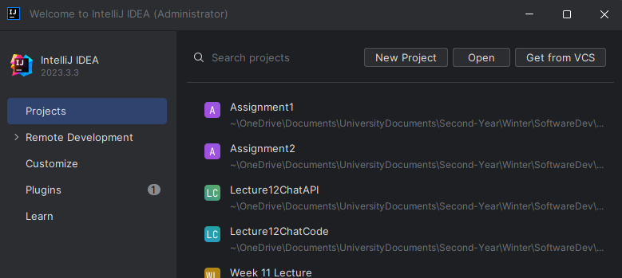
      
4. Paste the HTTPS GitHub repository clone URL into the URL input field, and select the directory you'd like to clone the repository into. 
    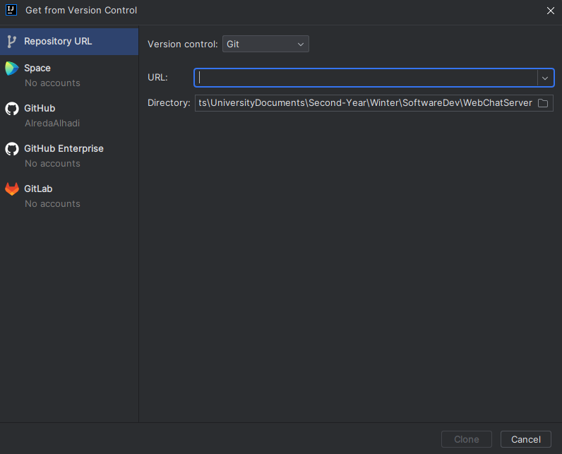
      
5. Click the Clone button to clone the application repository into your desired directory. This should only take a short period of time. 
    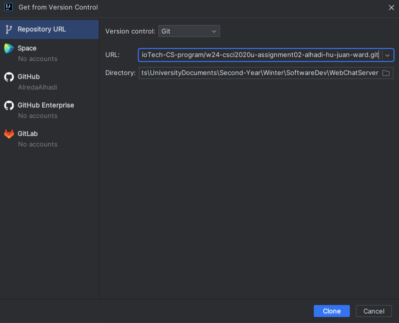
      
6. IntelliJ may ask if you want to Trust and Open the project, click "Trust Project" 
    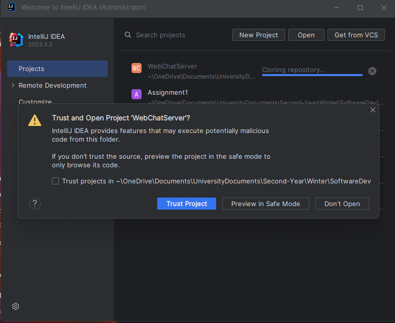
      

### To run the application

1. On Intellij, Open the directory that you cloned the repository into (this should have automatically happened right after you cloned the repository in the previous steps). 
    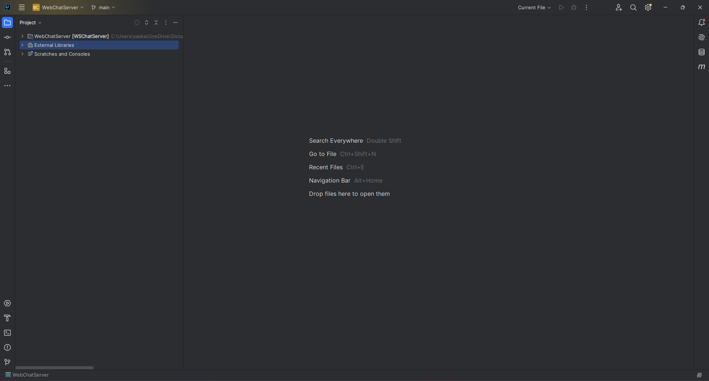
      
2. In the top right corner, click on "Current File", then click on "Edit Configurations..." 
    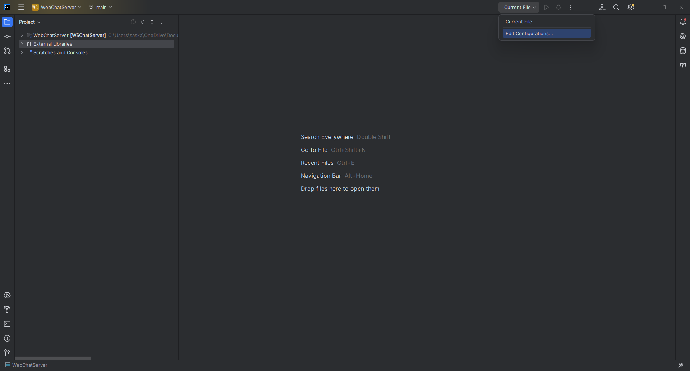
      
3. In the "Run/Debug Configurations" window, click the + symbol in the top left corner, then select a local glassFish Server. 
    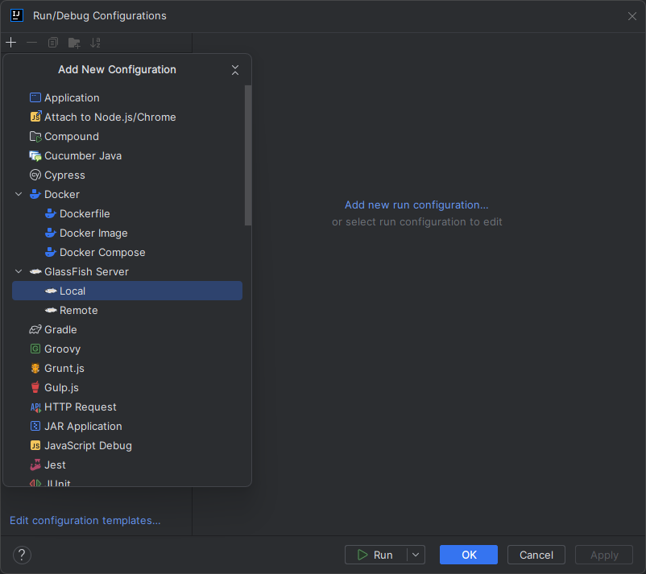
      
4. In the "Server Domain" input field, enter "domain1", and in the JRE input field select a JRE that's version 21 or newer. Then click on the Deployment tab.  
    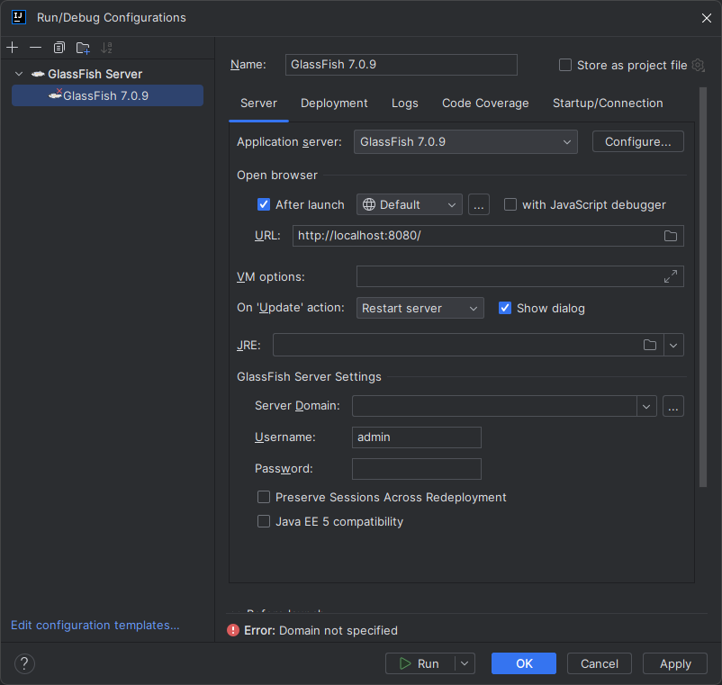
      
5. In the Deployment tab, click the + sign and select artifact.  
    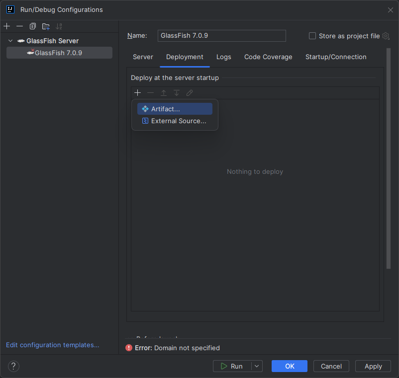
      
6. Select "WSChatServer:war exploded" and click OK  
    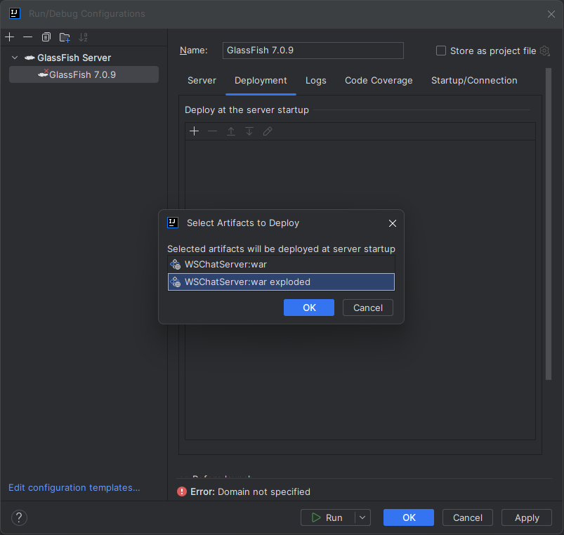
      
7. Now that you're done with the Run Configurations, click the  button to finally run the application  
    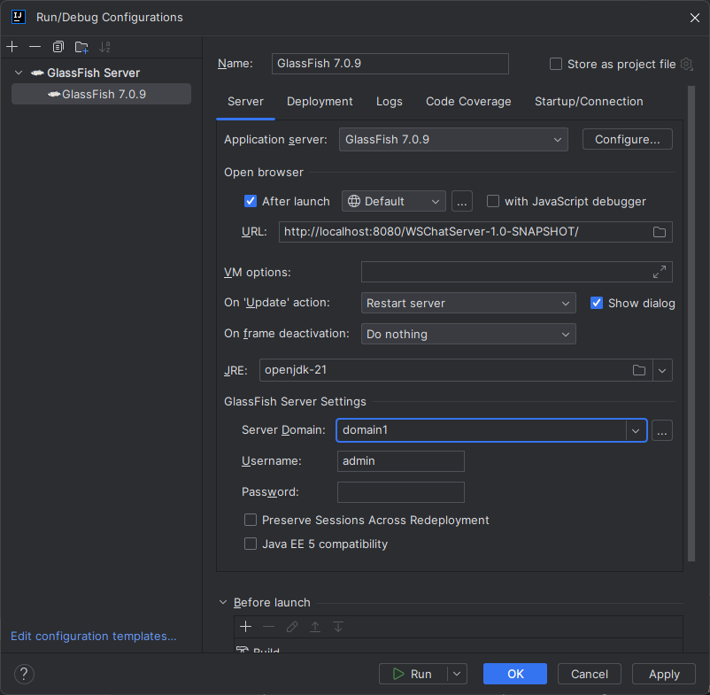
      
8. After a short period of time, the server should be deployed and the client will open in your default browser, where the Chat Server webpage will appear.  
      

## Contribution Report
### Contributions:
- Ali Hu:
    - implemented back-end message handling/sending including:
    - username entry, message handling/sending, creating rooms, adding/deleting/refreshing users, refreshing rooms
- Alreda Alhadi:
    - Improved the UI of the main page by adding animations and making it more visually appealing (HTML,CSS)
    - Added features such as typing indicator, user status messages, and sending images (backend, js)
    - created the readme file
- Alan Ward:
    - Implemented final design of about page HTML/CSS, and parts of main page functionality/ui JS/HTML/CSS
- Joshua Juan:
    - Implemented basic ui design, handling of messages to/from server (javascript).
